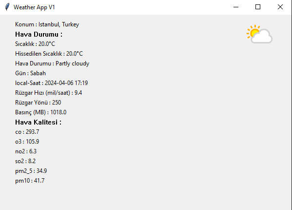

Made with 

<h3>ONLY <u>TURKISH, ISTANBUL</u> VERSION AVAILABLE 🇹🇷</h3>

- 〔⛅〕Gelişmiş Hava Durumunu gösterir
- 〔🌐〕İnternetten bilgi aldığı için bazı antivirüsler [Trojan](https://www.google.com/search?q=Trojan+virüs+Nedir) olarak gösterebilir
- 〔📥〕 **[İndirmek için tıklayın](https://github.com/XCATyt/Weather-ss/raw/main/Weatherss.exe)** 
- 〔🔨〕Son versiyon: **V1**
- 〔✨〕Uygulama Hava durumunu Gösterir bununlada kalmaz Hava Kalitesi gibi Daha çok şeyi gösterir!
- 〔⏳〕 2 saatte yapıldı
- 〔⛓〕API **[www.weatherapi.com](https://www.weatherapi.com/)** tarafındandır
- 〔♻〕API Sürekli Yenilenir, Uygulamada Güncel görmek istiyorsanız **Yenile** butonuna basın! 

**[XKEDI](https://www.youtube.com/@YDkedi)** Tarafından Yapıldı 🐱
- Discord : **[Yutupn Kedisi | YT sunucusuna katıl!](https://discord.gg/jrQQAvtWUC)** 🐱
